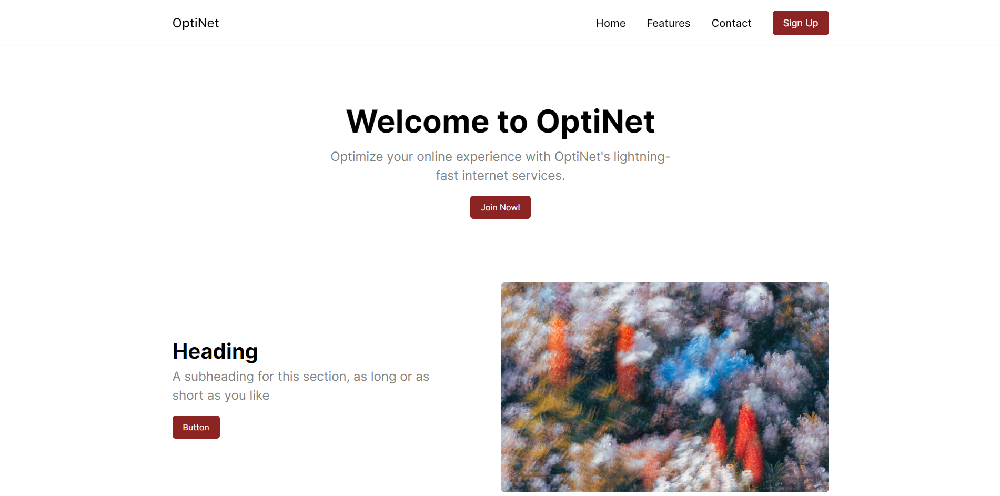

# ISP Services Website (Under Development)



## Overview
This repository hosts the codebase for our ISP (Internet Service Provider) services website, currently under development. It aims to provide a modern and efficient platform for customers to explore our internet plans, manage accounts, and access support resources.

## Technologies Used
- **Frontend:** ViteJS, Tailwind CSS
- **Backend:** Node.js, Express.js (planned)
- **Database:** Firebase Firestore (planned)
- **Deployment:** Deployment strategies (planned)

## Features (Planned)
- **Service Plans:** Detailed information about various internet plans.
- **Account Management:** User authentication and account dashboard.
- **Support Center:** FAQs, helpdesk ticketing system.
- **Responsive Design:** Mobile-friendly layout for seamless browsing.

## Getting Started
To get a local copy of this project up and running, follow these steps:

1. **Clone the repository:**
   ```bash
   git clone https://github.com/your-username/isp-services.git
   cd isp-services
